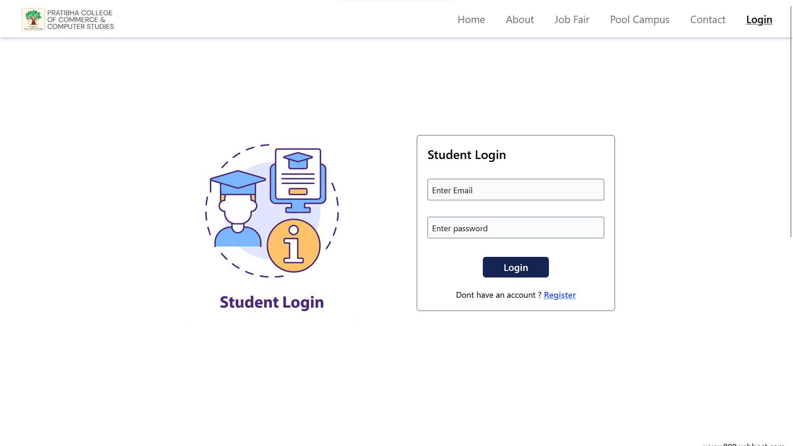

# Placement Cell PCCCS

### This is our college project developed by  [@PranavShilavane](https://www.instagram.com/pranavshilavane/) and [@DnyaneshwarWadje](https://www.instagram.com/dnyaneshwarwadje88/). 

### This is the simple project made using HTML, CSS, JS and PHP. FOr styling purpose we've used Tailwind CSS. Here MySQL is used as a database.

### Live Project Link : [ click here ](http://starpranav.000webhostapp.com/pcccs-project/index.php)

## Project Images: 

